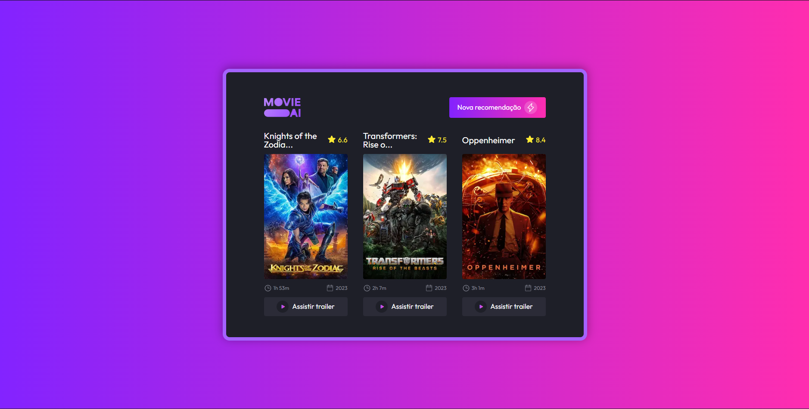

# Recomendação de filmes

Criei essa aplicação resolvendo o desafio 30 do #boraCodar da Rocketseat.

O intuito é criar uma aplicação que recomenda filmes.

Tive a ideia de utilizar a api The Movie Database (TMDB), com ela eu busco os filmes populares no momento, e com um algoritmo recupero 3 filmes aleatórios para mostrar ao usuário.

A aplicação foi criada utilizando NextJS 13 e Tailwind CSS, aproveitando o desafio tentei usufruir da nova funcionalidade de Server Components do Next :)

## Executar a aplicação

Execute o comando git pull ${URL_DO_PROJETO}

```bash
npm install
# or
yarn install
```

```bash
npm run dev
# or
yarn dev
```

## Imagens


